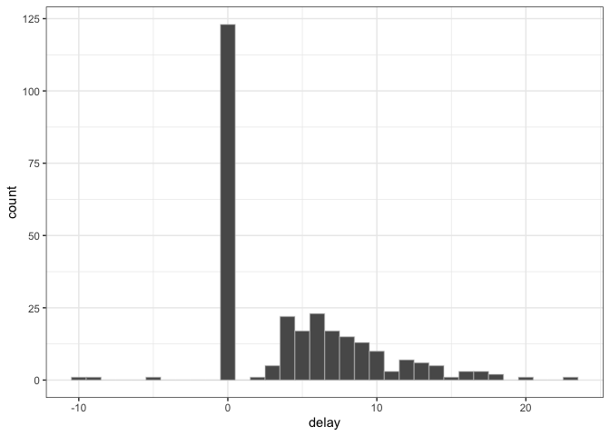
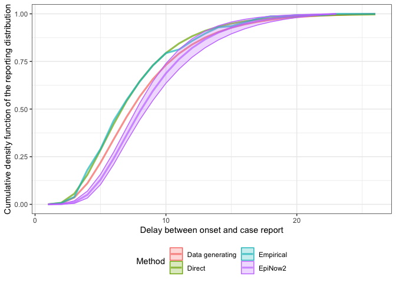
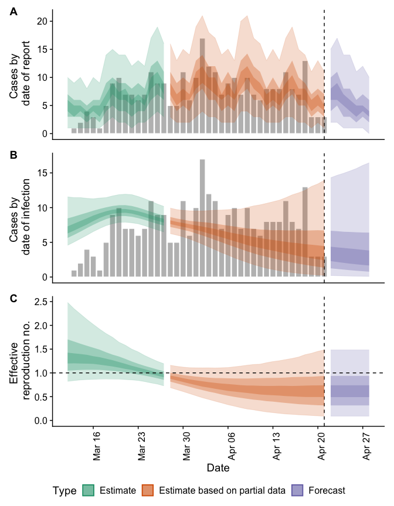

Estimating reporting delays and nowcasting/forecasting infections with
EpiNow2
================

# Summary

In this report we make use of
[EpiNow2](https://epiforecasts.io/EpiNow2/), a toolset for real-time
analysis of infectious disease dynamics, for estimating reporting delays
and using them to conduct a nowcast. We first explore the data extract
the estimated delay distribution and compare it to the the empirical
distribution, and the distribution estimated using simpler methods. We
then show how the these estimates may be used in `EpiNow2` to perform
nowcasts, forecasts and estimation of reproduction numbers and growth
rates. For more on `EpiNow2` roadmap see [the package
documentation](https://EpiNow2.io/epinowcast/). An [alternative
approach](epinowcast.md) to the problem using `epinowcast`, a package
undergoing active development and aiming to address some of the
limitations `EpiNow2` with a view to eventually replacing it, is also
available in this repository.

# Load required libraries

We first load the packages required for this case study. These can be
installed using

``` r
remotes::install_github("epiforecasts/nowcasting.example")
```

``` r
library("EpiNow2")
library("nowcasting.example") ## devtools::install()
library("dplyr")
library("ggplot2")
library("rstan")
library("posterior")
library("tidyr")
library("fitdistrplus")
```

# Load the data

As in other reports in this repository this data is generated using
`inst/scripts/create_mock_dataset.r`. The simulation model is set up to
mimic real-world datasets and an contains an underlying assumption that
the reporting delay is parametric and follows a truncated discretised
log-normal distribution with a logmean of 2 and a logsd of 0.5. On top
of this additional processes have been modelled so that some proportion
of cases are mising onsets, the number of cases with an onset reported
on the same day is inflated versus what would be expected from a
parametric distribution, and cases with a negative onset to report
delay. Settings in `inst/scripts/create_mock_dataset.r` can be altered
and the code in this case study rerun to explore other reporting
scenarios.

``` r
df <- load_data()
max_delay <- max(df$delay, na.rm = TRUE)
glimpse(df)
```

    ## Rows: 311
    ## Columns: 3
    ## $ date_onset  <date> 2020-02-29, 2020-02-29, NA, 2020-03-02, 2020-03-04, 2020-…
    ## $ report_date <date> 2020-03-18, 2020-03-05, 2020-03-05, 2020-03-09, 2020-03-1…
    ## $ delay       <int> 18, 5, NA, 7, 8, 4, 11, 0, NA, 0, 20, 5, 6, 6, 0, 0, 8, 10…

# Data exploration

We start by visualising the observed delays from onset to report.

``` r
ggplot(df, aes(x = delay)) +
  geom_histogram(binwidth = 1, col = "#d3d3d36e") +
  theme_bw()
```

<!-- -->

As expected, based on the generative model used to simulate our case
study data, there are negative delays (report before onset) - possibly
representing either data entry errors or positive tests during the
incubation period so hard to characterise as part of the reporting delay
distribution.

``` r
df |>
  filter(delay < 0)
```

    ## # A tibble: 3 × 3
    ##   date_onset report_date delay
    ##   <date>     <date>      <int>
    ## 1 2020-03-14 2020-03-05     -9
    ## 2 2020-03-18 2020-03-08    -10
    ## 3 2020-04-05 2020-03-31     -5

There is also a significant excess at delay 0, which does not connect
smoothly to the rest of the distribution and therefore might represent a
separate process or the combination of two processes.

# Estimating the reporting delay

We use `EpiNow2` to estimate the distribution of reporting delays
greater than 0.
We use a lognormal prior for this distribution with `meanlog` 0 (sd 1) and `sdlog` 1 (sd 1).

``` r
positive_df <- df |>
  filter(delay > 0)
snapshots <- create_snapshots(positive_df, max_delay)
est <- suppressWarnings(estimate_truncation(
  snapshots,
  truncation = trunc_opts(
    LogNormal(
      meanlog = Normal(0, 1),
      sdlog = Normal(1, 1),
      max = max_delay
    )
  ), 
  chains = 2, iter = 2000,
  verbose = FALSE
))

## parameters of lognormal fit
est$dist
```

    ## $mean
    ## [1] 2.1
    ## 
    ## $mean_sd
    ## [1] 0.032
    ## 
    ## $sd
    ## [1] 0.433
    ## 
    ## $sd_sd
    ## [1] 0.034
    ## 
    ## $max
    ## [1] 23

# Mean delay

``` r
## Extract probability mass function

cmf <- rstan::extract(est$fit, "trunc_rev_cmf")[[1]]
colnames(cmf) <- seq(max_delay, 1, by = -1) 
pmf <- as_draws_df(cmf) |>
  pivot_longer(c(-.chain, -.iteration, -.draw),
                      names_to = "delay") |>
  mutate(delay = as.integer(delay)) |>
  arrange(delay) |>
  group_by(.iteration, .chain, .draw) |>
  mutate(value = diff(c(0, value)))

## Calculate per-sample mean
mean <- pmf |>
  group_by(.chain, .iteration, .draw) |>
  summarise(mean = sum(delay * value), .groups = "drop") |>
  summarise(
    est = mean(mean),
    lower = quantile(mean, 0.025),
    upper = quantile(mean, 0.975)
  )

## Estimate + 95% CI of mean reporting delay
mean
```

    ## # A tibble: 1 × 3
    ##     est lower upper
    ##   <dbl> <dbl> <dbl>
    ## 1  9.31  8.75  9.89

# Comparison to simpler approaches

We compare the etimated delay distribution from `EpiNow2` with empirical
estimates, estimates from simpler methods, and the known distribution
used when simulating the data.

## Empirical delay

We first extract the observed empirical delay which would likely be the
first thing we estimate in a real-world setting. This could also be used
directly for nowcasting if we were confident it was static over the
timespan of our data, and the bias from truncation was small.

``` r
positive_df <- df |>
  filter(delay > 0)

x <- 1:26
emp <- ecdf(positive_df$delay)
emp_cdf <- data.frame(
  delay = x,
  cdf = emp(x),
  Method = "Empirical"
)

tail(emp_cdf, n = 7)
```

    ##    delay       cdf    Method
    ## 20    20 0.9935484 Empirical
    ## 21    21 0.9935484 Empirical
    ## 22    22 0.9935484 Empirical
    ## 23    23 1.0000000 Empirical
    ## 24    24 1.0000000 Empirical
    ## 25    25 1.0000000 Empirical
    ## 26    26 1.0000000 Empirical

## Discretised lognormal fitted directly

As we assume the reporting distribution is static and as our infectious
disease data appears to be relatively stable we could expect a direct
estimate of the underlying reporting distribution to be minimally
biased. In settings where we have rapid exponential growth we would
expect significantly more bias and would likely need to use methods
adjusted for truncation (as many nowcasting methods are or use a
specialised real-time distribution estimation method). In settings where
we have very little data that is not partially truncated or we expect
variation in our reporting distributions over time we would also need to
consider these approaches.

``` r
ddislnorm <- function(x, meanlog, sdlog) {
  return(plnorm(x, meanlog, sdlog) - plnorm(x - 1, meanlog, sdlog))
}
pdislnorm <- plnorm
qdislnorm <- qlnorm

y <- fitdist(
  positive_df$delay,
  "dislnorm",
  start = list(meanlog = 0, sdlog = 1)
)
ln <- pdislnorm(1:26, y$estimate[1], y$estimate[2])
ln_cdf <- data.frame(delay = x, cdf = ln, Method = "Direct")

tail(ln_cdf, n = 7)
```

    ##    delay       cdf Method
    ## 20    20 0.9864762 Direct
    ## 21    21 0.9895167 Direct
    ## 22    22 0.9918425 Direct
    ## 23    23 0.9936282 Direct
    ## 24    24 0.9950043 Direct
    ## 25    25 0.9960687 Direct
    ## 26    26 0.9968951 Direct

## Extract the lognormal CMF from `EpiNow2`

We can optain the cumulative mass function of the truncation
distribution as estimated by `EpiNow2` directly:

``` r
nowcast_cdf <- est$cmf |>
  rename(delay = index, cdf = mean) |>
  mutate(Method = "EpiNow2")
```

## Comparison

We now compare the various approaches to estimate the reporting
distribution against the known distribution used to generate the data.
We see that in this simple case all methods return similiar results but
that none fully capture the data generating process. This is likely due
to excluding onsets reported on the same day and motivates more complex
estimation methods that can account for this. Note that the bias in
these estimates will propagate through all downstream steps that make
use of them and the consequences of this may be hard to estimate.

``` r
true_cdf <- data.frame(
  delay = 1:26,
  cdf = pdislnorm(1:26, 2, 0.5) / pdislnorm(26, 2, 0.5),
  Method = "Data generating"
)

combined <- bind_rows(
  true_cdf,
  emp_cdf,
  ln_cdf,
  nowcast_cdf
)

ggplot(combined, aes(x = delay, y = cdf, col = Method, fill = Method)) +
  geom_line(size = 1.1, alpha = 0.7) +
  geom_ribbon(
    aes(ymin = lower_90, ymax = upper_90), alpha = 0.25
  ) +
  theme_bw() +
  theme(legend.position = "bottom") +
  guides(
    fill = guide_legend(nrow = 2),
    col = guide_legend(nrow = 2)
  ) +
  labs(
    x = "Delay between onset and case report",
    y = "Cumulative density function of the reporting distribution"
    )
```

<!-- -->

# Nowcast

First we construct the data set of onsets.

``` r
## create a data set of reported cases
## (would be better to use onsets but missing data are an issue)
reported_cases <- df |>
  count(report_date, name = "confirm") |>
  rename(date = report_date)
```

We then use the `estimate_infections` function contained in `EpiNow2` on
this data set to obtain a nowcast, forecast and reproduction number
estimate.

``` r
## generation interval
## from: https://www.gov.uk/government/publications/monkeypox-outbreak-technical-briefings/investigation-into-monkeypox-outbreak-in-england-technical-briefing-1
## Preliminary estimate of the serial interval is 9.8 days though with high uncertainty (95% credible interval, 5.9 to 21.4).
## It is unclear whether this refers to the estimate of the mean, or the spread of serial intervals
## It is also unclear whether this is growth-adjusted.
## We interpret it here as discretised gamma distributed with mean (5.9 + 21.4) / 2 = 13.65
## and sd = sqrt(13.65) = 3.7 (THIS IS FOR ILLUSTRATION ONLY AND SHOULD NOT BE USED)
generation_interval <- list(
  mean = 13.65,
  mean_sd = 0,
  sd = 3.7,
  sd_sd = 0,
  max = 25
)

## incubation period
## from: https://www.who.int/news-room/fact-sheets/detail/monkeypox
## "usually from 6 to 13 days but can range from 5 to 21"
## interpreted as log-normally distributed with 2/3 contained between 6 and 13:
## => \mu*/\sigma* = 6; \mu^* * \sigma* = 13
## => \mu* = 9, \sigma* = 1.5,  max = 21
## (see https://en.wikipedia.org/wiki/Log-normal_distribution#Scatter_intervals)
## also adding a small amount of uncertainty
incubation_period <- list(
  mean = log(9),
  mean_sd = 0.1,
  sd = log(1.5),
  sd_sd = 0.1,
  max = 21
)

delays <- delay_opts(
  ## incubation period
  incubation_period,
  ## reporting delay
  est$dist
)

inf <- estimate_infections(
  reported_cases = reported_cases,
  generation_time = generation_interval,
  delays = delays,
  verbose = FALSE
)

plot(inf)
```

<!-- -->
