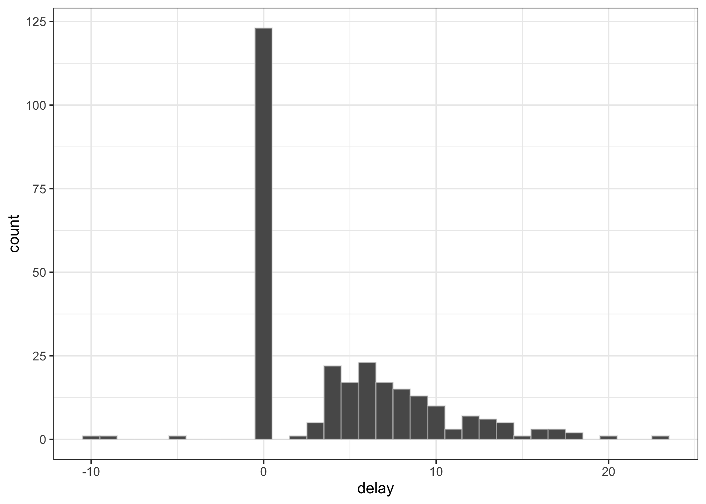
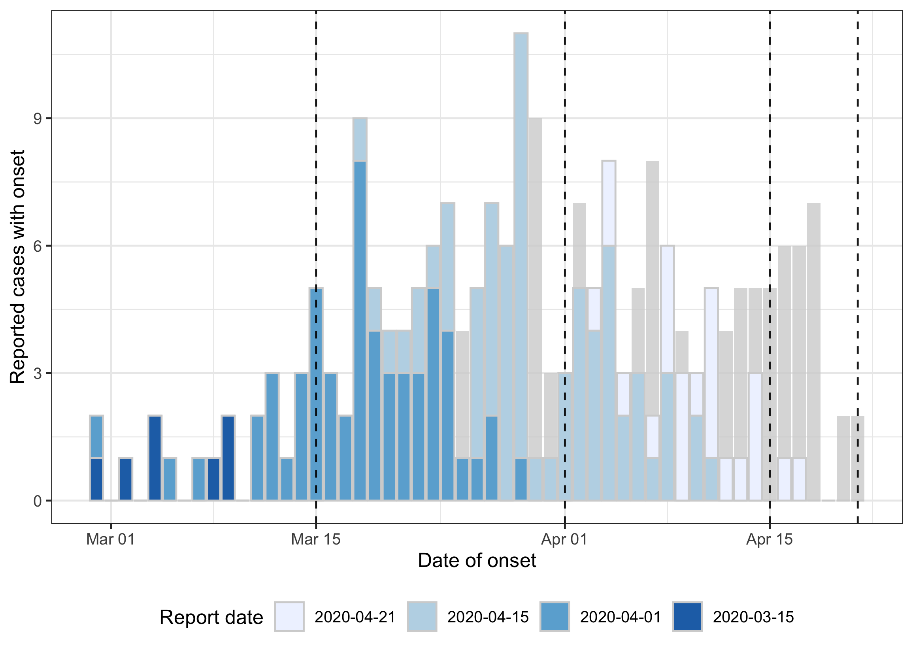
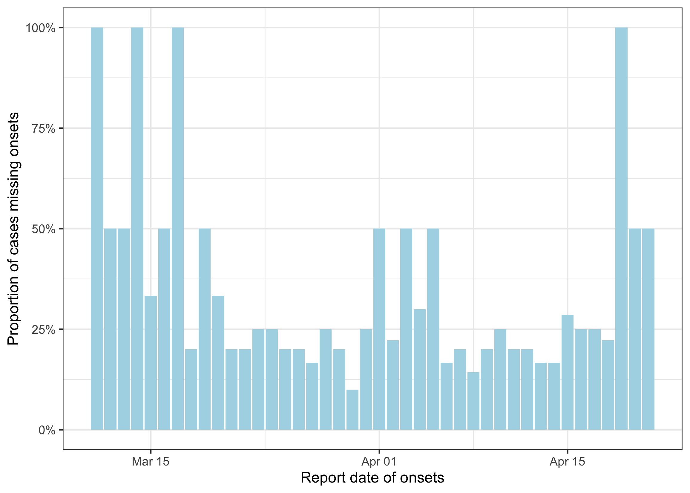
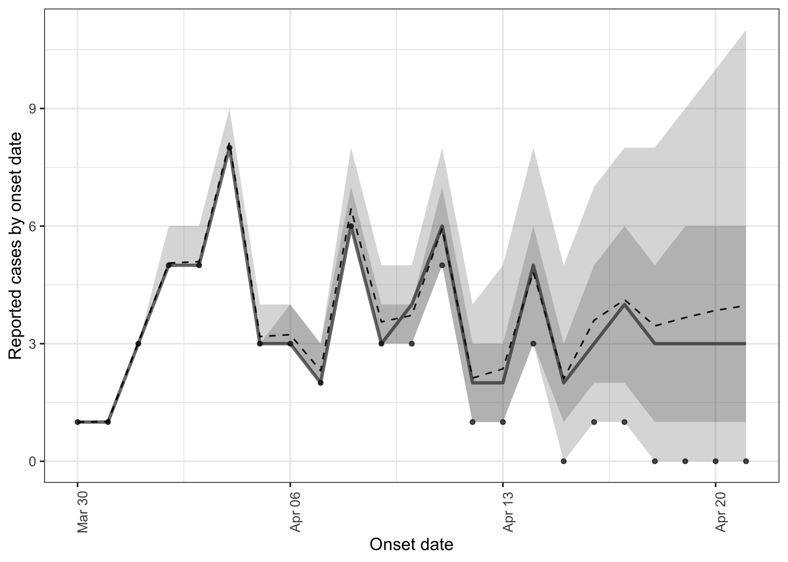
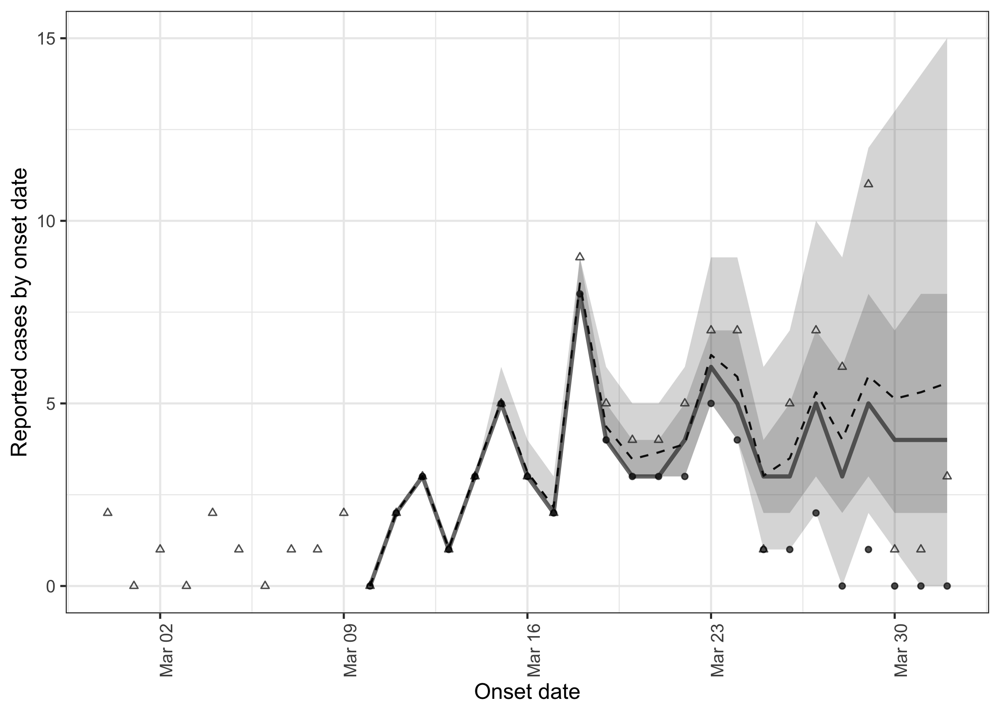
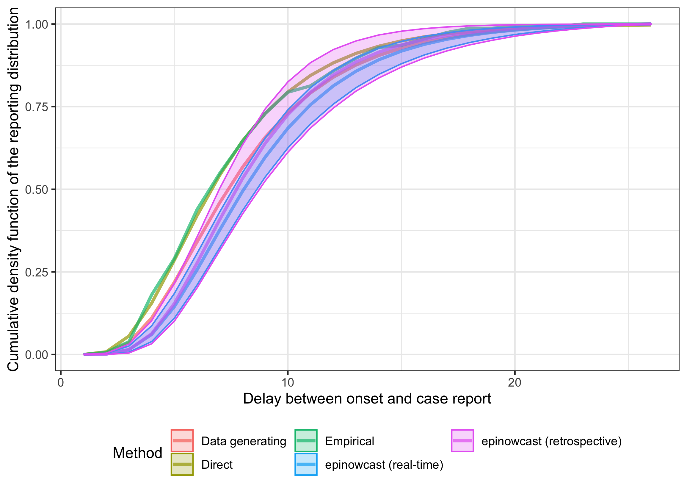
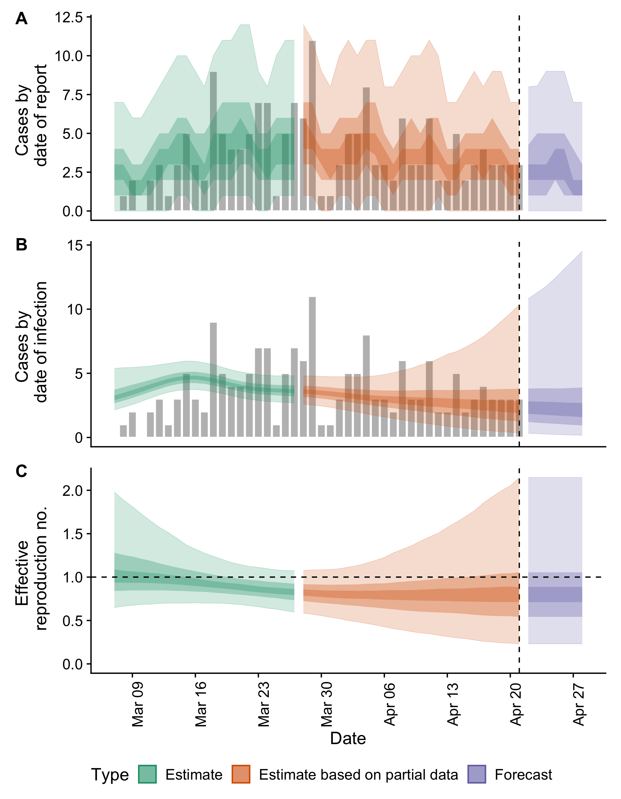

Estimating reporting delays and nowcasting/forecasting infections with
epinowcast
================

# Summary

In this report we make use of
[epinowcast](https://epiforecasts.io/epinowcast/), a nowcasting package
under development and designed from the ground up around nowcasting with
the aim of replacing [EpiNow2](https://epiforecasts.io/EpiNow2/) for
real-time usage. We first explore the data using tools from `epinowcast`
alongside others. We then nowcast the latest available data, visualise
our results, and discuss potential options for improving performance on
real-world data. As a check of our approach we construct some
retrospective data, nowcast it, and compare our nowcast to the latest
available data. We then extract the estimated delay distribution and
compare it to the underlying distribution used to generate the data, the
empirical distribution, and the distribution estimated using simpler
methods. Finally, we show how the output from `epinowcast` may be used
in other surveillance packages such as `EpiNow2`. Throughout this case
study we discuss potential issues with the approaches taken, and
highlight areas for futher work. For more on `epinowcast` and it’s
planned development roadmap see [the package
documentation](https://epiforecasts.io/epinowcast/). An [alternative
approach](epinow2.md) to the problem using `EpiNow2`, suffering from
some limitations that `epinowcast` is aiming to address, is also
available in this repository.

# Load required libraries

We first load the packages required for this case study. These can be
installed using

``` r
remotes::install_github("epiforecasts/nowcasting.example")
```

This report is based on the current stable version `epinowcast 0.1.0`
but we highlight below where relevant missing features are planned for
the next version `epinowcast 0.2.0`.

``` r
library("epinowcast")
library("EpiNow2")
library("nowcasting.example") ## devtools::install()
library("dplyr")
library("ggplot2")
library("rstan")
library("posterior")
library("tidyr")
library("fitdistrplus")
library("purrr")
library("forcats")
```

# Load the data

As in other reports in this repository this data is generated using
`inst/scripts/create_mock_dataset.r`. The simulation model is set up to
mimic real-world datasets and an contains an underlying assumption that
the reporting delay is parametric and follows a truncated discretised
log-normal distribution with a logmean of 2 and a logsd of 0.5. On top
of this additional processes have been modelled so that some proportion
of cases are mising onsets, the number of cases with an onset reported
on the same day is inflated versus what would be expected from a
parametric distribution, and cases with a negative onset to report
delay. Settings in `inst/scripts/create_mock_dataset.r` can be altered
and the code in this case study rerun to explore other reporting
scenarios.

``` r
df <- load_data()
max_delay <- max(df$delay, na.rm = TRUE)
glimpse(df)
#> Rows: 311
#> Columns: 3
#> $ date_onset  <date> 2020-02-29, 2020-02-29, NA, 2020-03-02, 2020-03-04, 2020-…
#> $ report_date <date> 2020-03-18, 2020-03-05, 2020-03-05, 2020-03-09, 2020-03-1…
#> $ delay       <int> 18, 5, NA, 7, 8, 4, 11, 0, NA, 0, 20, 5, 6, 6, 0, 0, 8, 10…
```

# Data exploration

We start by visualising the observed delays from onset to report.

``` r
ggplot(df, aes(x = delay)) +
  geom_histogram(binwidth = 1, col = "#d3d3d36e") +
  theme_bw()
```



As expected, based on the generative model used to simulate our case
study data, there are negative delays (report before onset) - possibly
representing either data entry errors or positive tests during the
incubation period so hard to characterise as part of the reporting delay
distribution.

``` r
df |>
  filter(delay < 0)
#> # A tibble: 3 × 3
#>   date_onset report_date delay
#>   <date>     <date>      <int>
#> 1 2020-03-14 2020-03-05     -9
#> 2 2020-03-18 2020-03-08    -10
#> 3 2020-04-05 2020-03-31     -5
```

There is also a significant excess at delay 0, which does not connect
smoothly to the rest of the distribution and therefore might represent a
separate process or the combination of two processes.

# Preprocessing and visualising the data

Before we can estimate the reporting delay for onsets or nowcast
unreporteed onsets we need to preprocess the data into a format
`epinowcast` can make use of. We first restrict to delays greater than 0
due to the evidence for two reporting processes and aggregate data into
the cumulative count format `epinowcast` expects, removing missing data
in the process (handling missing data in `epinocwast` is a feature
currently [being
implemented](https://github.com/epiforecasts/epinowcast/pull/107)). Note
that `epinowcast` defines the target date (here the onset date) as the
`reference_date`.

``` r
count_df <- df |>
  filter(delay > 0 | is.na(delay)) |>
  rename(reference_date = date_onset) |>
  count(reference_date, report_date, name = "confirm") |>
  arrange(reference_date, report_date) |>
  group_by(reference_date) |>
  mutate(cum_confirm = cumsum(confirm)) |>
  ungroup() |>
  mutate(confirm = ifelse(!is.na(reference_date), cum_confirm, confirm)) |>
  dplyr::select(-cum_confirm)
glimpse(count_df)
#> Rows: 152
#> Columns: 3
#> $ reference_date <date> 2020-02-29, 2020-02-29, 2020-03-02, 2020-03-04, 2020-0…
#> $ report_date    <date> 2020-03-05, 2020-03-18, 2020-03-09, 2020-03-08, 2020-0…
#> $ confirm        <int> 1, 2, 1, 1, 2, 1, 1, 1, 2, 1, 2, 1, 2, 3, 1, 1, 2, 3, 2…
```

We can now use preprocessing functions from `epinowcast` to complete all
combinations of report and reference dates, prepare for modelling, and
produce a range of useful summary datasets. Note that `epinowcast`
returns output as `data.table` but users can make use of whatever data
manipulation tools they are most comfortable with (e.g., tidyverse
tools). We first make sure all date combinations are present and then
use a wrapper, `enw_preprocess_data()` to complete the rest of the
required preprocessing steps. We set the maximum delay using the largest
observed delay which assumes reporting after this point is not possible.
In general, users should consider setting the maximum delay with care as
larger values require significantly increased compute whilst smaller
values may insufficiently capture reporting distributions leading to
bias.

``` r
complete_df <- count_df |>
  enw_complete_dates(max_delay = max_delay)
glimpse(complete_df)
#> Rows: 1,049
#> Columns: 3
#> $ reference_date <date> 2020-02-29, 2020-02-29, 2020-02-29, 2020-02-29, 2020-0…
#> $ report_date    <date> 2020-02-29, 2020-03-01, 2020-03-02, 2020-03-03, 2020-0…
#> $ confirm        <int> 0, 0, 0, 0, 0, 1, 1, 1, 1, 1, 1, 1, 1, 1, 1, 1, 1, 1, 2…

enw_df <- complete_df |>
  enw_preprocess_data(max_delay = max_delay)
enw_df
#>                     obs         new_confirm             latest
#> 1: <data.table[1019x7]> <data.table[966x9]> <data.table[53x8]>
#>     missing_reference  reporting_triangle      metareference
#> 1: <data.table[53x4]> <data.table[53x25]> <data.table[53x7]>
#>             metareport          metadelay time snapshots by groups max_delay
#> 1: <data.table[75x10]> <data.table[23x4]>   53        53         1        23
#>      max_date
#> 1: 2020-04-21
```

Our output contains several useful measures including the maximum date
of observations, the maximum delay, the number of days included in the
dataset, and the number of groups (here only one but this feature allows
us to nowcast over stratifications such as age or location or a
combination of multiple variables).

To start with we may want to plot the latest available data alongside
some previous updates (blue bars become increasingly pale as data get
more recent) and the data by date of report (grey bars).

``` r
enw_df$new_confirm[[1]] |>
  mutate(report_date = case_when(
    report_date <= as.Date("2020-03-15") ~ as.Date("2020-03-15"),
    report_date <= as.Date("2020-04-01") ~ as.Date("2020-04-01"),
    report_date <= as.Date("2020-04-15") ~ as.Date("2020-04-15"),
    report_date <= max(report_date) ~ as.Date(max(report_date))
  )) |>
  group_by(reference_date, report_date) |>
  summarise(confirm = sum(new_confirm), .groups = "drop") |>
  mutate(report_date = factor(report_date) |>
    forcats::fct_rev()
  ) |>
  ggplot() +
  aes(
    x = reference_date, y = confirm, fill = report_date, group = report_date
  ) +
  geom_col(
    data = enw_df$new_confirm[[1]] |>
      group_by(report_date) |>
      summarise(confirm = sum(new_confirm)),
    fill = "lightgrey", alpha = 0.8,
    aes(x = report_date)
  ) +
  geom_col(position = "stack", alpha = 1, col = "lightgrey") +
  geom_vline(
    aes(xintercept = as.Date(report_date)), linetype = 2, alpha = 0.9
  ) +
  scale_y_continuous(labels = ~ scales::comma(.x, accuracy = 1)) +
  scale_fill_brewer(palette = "Blues") +
  theme_bw() +
  labs(
    x = "Date of onset", y = "Reported cases with onset", fill = "Report date"
  ) +
  theme(legend.position = "bottom")
```



For many use cases (such as estimating the effective reproduction
number) if the proportion of missing onsets is stable over the timespan
considered then no bias will be introduced by excluding missing data.
However, where the proportion of missing onsets does vary over time bias
will be introduced. Dealing with this bias is part of the development
roadmap for `epinowcast 0.2.0`. Here we plot this proportion over time
and see that as expected it appears stable over time though daily
estimates are clearly impacted by varying sample size and stochastic
variation.

``` r
enw_df$missing_reference[[1]] |>
  as_tibble() |>
  filter(report_date >= "2020-03-11") |>
  ggplot() +
  aes(x = report_date, y = prop_missing) +
  geom_col(fill = "lightblue") +
  scale_y_continuous(labels = scales::percent) +
  theme_bw() +
  labs(x = "Report date of onsets", y = "Proportion of cases missing onsets")
```



# Nowcasting

`epinowcast` implements a generic and extended form of one of the most
common nowcasting approaches. This involves decomposing the task into
two sub-models: an expectation model that captures the evolution of the
underlying count data (here by default a daily random walk on the log
scale), and a reporting model specified using the discrete hazard of a
case being reported after a given number of days. More on the
methodology of this implementation and its links to previous literature
can be found [here](https://epiforecasts.io/epinowcast/).

Here we use a simple model that assumes a Poisson observation process
and a parametric log-normal reporting distribution. As a first step, we
need to compile the `epinowcast` model, we do this with `threads = TRUE`
in order to support multi-threading to speed up estimation, and define
our fitting options (note these are passed to `cmdstanr` which is the
backend tool used in `epinowcast` for model fitting).

``` r
model <- enw_model(threads = TRUE)

fit_opts <- enw_fit_opts(
    chains = 2, parallel_chains = 2, threads_per_chain = 2,
    iter_sampling = 1000, iter_warmup = 1000, adapt_delta = 0.9,
    show_messages = FALSE, refresh = 0, pp = TRUE
)
```

We can then fit our nowcasting model. If interested in what each
component is doing the output can be inspected interactively (for
example the output of `enw_obs(family = "poisson", data = enw_df)` are
observations preprocessed into the format required for modelling).

``` r
simple_nowcast <- epinowcast(
  obs = enw_obs(family = "poisson", data = enw_df),
  data = enw_df, model = model, fit = fit_opts,
)
#> Running MCMC with 2 parallel chains, with 2 thread(s) per chain...
#> 
#> Chain 1 finished in 24.1 seconds.
#> Chain 2 finished in 24.2 seconds.
#> 
#> Both chains finished successfully.
#> Mean chain execution time: 24.2 seconds.
#> Total execution time: 24.4 seconds.
```

The first thing we might want to do is look at the summarised nowcast
for the last week.

``` r
simple_nowcast |>
  summary(probs = c(0.05, 0.95)) |>
  dplyr::select(
    reference_date, report_date, delay, confirm, mean, median, sd, mad
  ) |>
  tail(n = 7)
#>    reference_date report_date delay confirm   mean median       sd    mad
#> 1:     2020-04-15  2020-04-21     6       0 2.1275      2 1.676201 1.4826
#> 2:     2020-04-16  2020-04-21     5       1 3.6195      3 1.960776 1.4826
#> 3:     2020-04-17  2020-04-21     4       1 4.1530      4 2.322561 1.4826
#> 4:     2020-04-18  2020-04-21     3       0 3.5490      3 2.710401 2.9652
#> 5:     2020-04-19  2020-04-21     2       0 3.7140      3 3.262748 2.9652
#> 6:     2020-04-20  2020-04-21     1       0 3.9770      3 3.588999 2.9652
#> 7:     2020-04-21  2020-04-21     0       0 4.1245      3 4.363774 2.9652
```

We can also plot this nowcast against the latest data.

``` r
simple_nowcast |>
  plot() +
  labs(x = "Onset date", y = "Reported cases by onset date")
```



Finally, we can also look at the posterior estimates for the parametric
delay distribution (remembering that a logmean of 2 and a logsd of 0.5
was used to generate the simulated data). Here `refp_mean` denotes the
logmean and `refp_sd` denotes the log standard deviation. We see our
estimates are close to those from the data generating process though
don’t cover them at the 90% credible interval. This may be driven by
bias in the generating process, (as 0 delays are excluded), by our use
of a distribution truncated by the maximum delay, inherent loss/lack of
information, or from biases introduced by our estimation method.

``` r
simple_nowcast |>
  summary(type = "fit", variables = c("refp_mean", "refp_sd")) |>
  dplyr::select(variable, mean, median, sd, mad)
#>        variable      mean   median         sd        mad
#> 1: refp_mean[1] 2.0906628 2.090190 0.04155905 0.04071961
#> 2:   refp_sd[1] 0.4520799 0.450263 0.03108413 0.03078693
```

In real-world data we might expect to see delays drawn from different
distributions or no apparent distribution, time-varying delays in
reporting, overdispersed reporting, and the likelihood of reporting
varying by report date (i.e due to the day of the week etc.). All of
these complexities can be modelled using `epinowcast 0.1.0`.

As we saw in our data, we also have negative delays, overinflated counts
with zero delays, reported cases missing onsets and a clear day of the
week effect in the underlying simulated data. Modelling all of these
features, rather than exluding them or ignoring them, would likely
reduce bias. These features, exluding negative delays, are on the
roadmap for `epinowcast 0.2.0`. Please reach out if they would be of use
to you. Negative delays are potentially the most complex modelling issue
as they are technically not possible if we define a reporting date to be
later than or equal to the reference date, which is how many nowcasting
models work. We instead need a different generative process that leads
to both of these observations. This extension is planned for a future
version of `epinowcast` but not currently in the roadmap.

# Retrospective evaluation

In order to understand how well our nowcasting method is working in
real-time it can be useful to have an understanding on how well it did
on past data that is now more fully reported. Here we produce another
nowcast, in the same way as before, but on a reconstructed version of
what we think the data available on the 1st of April 2020 would have
looked like. The first step is to construct this retrospective data and
to extract what the latest data looks like for this time period.

``` r
retro_df <- complete_df |>
 enw_filter_report_dates(latest_date = "2020-04-01")

latest_retro_obs <- complete_df |>
  enw_latest_data() |>
  enw_filter_reference_dates(latest_date = "2020-04-01")
tail(latest_retro_obs, n = 5)
#>    reference_date report_date confirm
#> 1:     2020-03-28  2020-04-20       6
#> 2:     2020-03-29  2020-04-21      11
#> 3:     2020-03-30  2020-04-21       1
#> 4:     2020-03-31  2020-04-21       1
#> 5:     2020-04-01  2020-04-21       3
```

We can now preprocess the data as before and fit the same nowcasting
model. Note it is significantly faster to fit as less data is being
used.

``` r
retro_nowcast <- retro_df |>
  enw_preprocess_data(max_delay = max_delay) |>
  (\(data) epinowcast(
    obs = enw_obs(family = "poisson", data = data),
    data = data, model = model, fit = fit_opts
    )
  )()
#> Running MCMC with 2 parallel chains, with 2 thread(s) per chain...
#> 
#> Chain 2 finished in 15.7 seconds.
#> Chain 1 finished in 15.8 seconds.
#> 
#> Both chains finished successfully.
#> Mean chain execution time: 15.7 seconds.
#> Total execution time: 16.0 seconds.
```

We now plot this retrospective nowcast against the latest available data
(noting that some of the more recently reported data may not be fully
complete yet). Here we see our approach is doing relatively well at
capturing the lastest available obserservations (triangles) using the
data available at the time (circles) though perhaps is a little more
uncertain than we might ideally like.

``` r
plot(retro_nowcast, latest_retro_obs) +
  labs(x = "Onset date", y = "Reported cases by onset date")
```



# Comparison to simpler approaches

We compare the etimated delay distribution from `epinowcast` with
empirical estimates, estimates from simpler methods, and the known
distribution used when simulating the data.

## Empirical delay

We first extract the observed empirical delay which would likely be the
first thing we estimate in a real-world setting. This could also be used
directly for nowcasting if we were confident it was static over the
timespan of our data, and the bias from truncation was small.

``` r
positive_df <- df |>
  filter(delay > 0)

x <- 1:26
emp <- ecdf(positive_df$delay)
emp_cdf <- data.frame(
  delay = x,
  cdf = emp(x),
  Method = "Empirical"
)

tail(emp_cdf, n = 7)
#>    delay       cdf    Method
#> 20    20 0.9935484 Empirical
#> 21    21 0.9935484 Empirical
#> 22    22 0.9935484 Empirical
#> 23    23 1.0000000 Empirical
#> 24    24 1.0000000 Empirical
#> 25    25 1.0000000 Empirical
#> 26    26 1.0000000 Empirical
```

## Discretised lognormal fitted directly

As we assume the reporting distribution is static and as our infectious
disease data appears to be relatively stable we could expect a direct
estimate of the underlying reporting distribution to be minimally
biased. In settings where we have rapid exponential growth we would
expect significantly more bias and would likely need to use methods
adjusted for truncation (as many nowcasting methods are or use a
specialised real-time distribution estimation method). In settings where
we have very little data that is not partially truncated or we expect
variation in our reporting distributions over time we would also need to
consider these approaches.

``` r
ddislnorm <- function(x, meanlog, sdlog) {
  return(plnorm(x, meanlog, sdlog) - plnorm(x - 1, meanlog, sdlog))
}
pdislnorm <- plnorm
qdislnorm <- qlnorm

y <- fitdist(
  positive_df$delay,
  "dislnorm",
  start = list(meanlog = 0, sdlog = 1)
)
ln <- pdislnorm(1:26, y$estimate[1], y$estimate[2])
ln_cdf <- data.frame(delay = x, cdf = ln, Method = "Direct")

tail(ln_cdf, n = 7)
#>    delay       cdf Method
#> 20    20 0.9864762 Direct
#> 21    21 0.9895167 Direct
#> 22    22 0.9918425 Direct
#> 23    23 0.9936282 Direct
#> 24    24 0.9950043 Direct
#> 25    25 0.9960687 Direct
#> 26    26 0.9968951 Direct
```

## Extract the lognormal CMF from `epinowcast`

As we have produced posterior samples of the log-normal distribution
summary parameters when producing a nowcast with `epinowcast` we can
calculate the log-normal CMF posterior from them using the following
code.

``` r
extract_epinowcast_cdf <- function(nowcast) {
  nowcast |>
  (\(x) x$fit[[1]]$draws(variables = c("refp_mean", "refp_sd")))() |>
  as_draws_df() |>
  mutate(cdf = purrr::map2(
    `refp_mean[1]`, `refp_sd[1]`,
    ~ tibble(
      delay = 1:26, cdf = pdislnorm(1:26, .x, .y) /  pdislnorm(26, .x, .y)
    ))
  ) |>
  unnest(cdf) |>
  group_by(delay) |>
  summarise(
    mean = mean(cdf),
    lower_90 = quantile(cdf, probs = 0.05),
    upper_90 = quantile(cdf, probs = 0.95)
  ) |>
  rename(cdf = mean)
}

nowcast_cdf <- list(
  "epinowcast (real-time)" = simple_nowcast,
  "epinowcast (retrospective)" = retro_nowcast
) |>
  map_df(extract_epinowcast_cdf, .id = "Method")

glimpse(nowcast_cdf)
#> Rows: 52
#> Columns: 5
#> $ Method   <chr> "epinowcast (real-time)", "epinowcast (real-time)", "epinowca…
#> $ delay    <int> 1, 2, 3, 4, 5, 6, 7, 8, 9, 10, 11, 12, 13, 14, 15, 16, 17, 18…
#> $ cdf      <dbl> 4.412032e-06, 1.190595e-03, 1.481482e-02, 6.063931e-02, 1.448…
#> $ lower_90 <dbl> 1.403677e-07, 2.848314e-04, 6.990544e-03, 3.903321e-02, 1.098…
#> $ upper_90 <dbl> 1.772726e-05, 2.948889e-03, 2.570660e-02, 8.678727e-02, 1.845…
```

## Comparison

We now compare the various approaches to estimate the reporting
distribution against the known distribution used to generate the data.
We see that in this simple case all methods return similiar results but
that none fully capture the data generating process. This is likely due
to excluding onsets reported on the same day and motivates more complex
estimation methods that can account for this. Note that the bias in
these estimates will propagate through all downstream steps that make
use of them and the consequences of this may be hard to estimate.

``` r
true_cdf <- data.frame(
  delay = 1:26,
  cdf = pdislnorm(1:26, 2, 0.5) / pdislnorm(26, 2, 0.5),
  Method = "Data generating"
)

combined <- bind_rows(
  true_cdf,
  emp_cdf,
  ln_cdf,
  nowcast_cdf
)

ggplot(combined, aes(x = delay, y = cdf, col = Method, fill = Method)) +
  geom_line(size = 1.1, alpha = 0.7) +
  geom_ribbon(
    aes(ymin = lower_90, ymax = upper_90), alpha = 0.25
  ) +
  theme_bw() +
  theme(legend.position = "bottom") +
  guides(
    fill = guide_legend(nrow = 2),
    col = guide_legend(nrow = 2)
  ) +
  labs(
    x = "Delay between onset and case report",
    y = "Cumulative density function of the reporting distribution"
    )
```



# Estimate the effective reproduction number using nowcast onsets

We now give an example of a potential use case estimating the effective
reproduction number in real-time using `EpiNow2`. Note that here we make
use of cases by date of onset but exclude onsets with a zero day delay
in reporting, onsets with a negative day delay in reporting, and
reported cases missing a onset date. In this example, where we know
these proportions are static this will not introdue bias but in general
this may not be the case. Note that we also only use the median
posterior nowcast estimate and so our effective reproduction number
estimates will be spuriously precise closer to the date of estimation. A
simple approach to deal with this is to re-estimate for multiple
posterior nowocast samples. A more robust approach is to estimate
everything in a single model and this is a planned feature for
`epinowcast`. Please reach out if this functionality could be of use to
you.

First we construct the data set of onsets.

``` r
## create a data set of onsets combining observations with nowcast estimates
## note  that we exclude reported cases with missing onsets but that this will 
## only introduce bias if the proportion missing varies over time.

nowcast_cases <- summary(simple_nowcast) |>
  mutate(confirm = median)

reported_cases <- complete_df |>
  enw_latest_data() |>
  filter(reference_date < min(nowcast_cases$reference_date)) |>
  bind_rows(nowcast_cases) |>
  rename(date = reference_date) |>
  dplyr::select(date, confirm)
```

Next, we set the necessary parameters for estimating the reproduction
number:

``` r
## generation interval
## from: https://www.gov.uk/government/publications/monkeypox-outbreak-technical-briefings/investigation-into-monkeypox-outbreak-in-england-technical-briefing-1
## Preliminary estimate of the serial interval is 9.8 days though with high uncertainty (95% credible interval, 5.9 to 21.4).
## It is unclear whether this refers to the estimate of the mean, or the spread of serial intervals
## It is also unclear whether this is growth-adjusted.
## We interpret it here as discretised gamma distributed with mean (5.9 + 21.4) / 2 = 13.65
## and sd = sqrt(13.65) = 3.7 (THIS IS FOR ILLUSTRATION ONLY AND SHOULD NOT BE USED)
generation_interval <- list(
  mean = 13.65,
  mean_sd = 0,
  sd = 3.7,
  sd_sd = 0,
  max = 25
)

## incubation period
## from: https://www.who.int/news-room/fact-sheets/detail/monkeypox
## "usually from 6 to 13 days but can range from 5 to 21"
## interpreted as log-normally distributed with 2/3 contained between 6 and 13:
## => \mu*/\sigma* = 6; \mu^* * \sigma* = 13
## => \mu* = 9, \sigma* = 1.5,  max = 21
## (see https://en.wikipedia.org/wiki/Log-normal_distribution#Scatter_intervals)
## also adding a small amount of uncertainty
incubation_period <- list(
  mean = log(9),
  mean_sd = 0.1,
  sd = log(1.5),
  sd_sd = 0.1,
  max = 21
)
```

We model onsets so there is no additional delay beyond the incubation
period

``` r
delays <- delay_opts(
  incubation_period
)
```

We then use the `estimate_infections` function contained in `EpiNow2` on
this data set to estimate the reproduction number.

``` r
inf <- estimate_infections(
  reported_cases = reported_cases,
  generation_time = generation_interval,
  delays = delays,
  verbose = FALSE
)

plot(inf)
```


