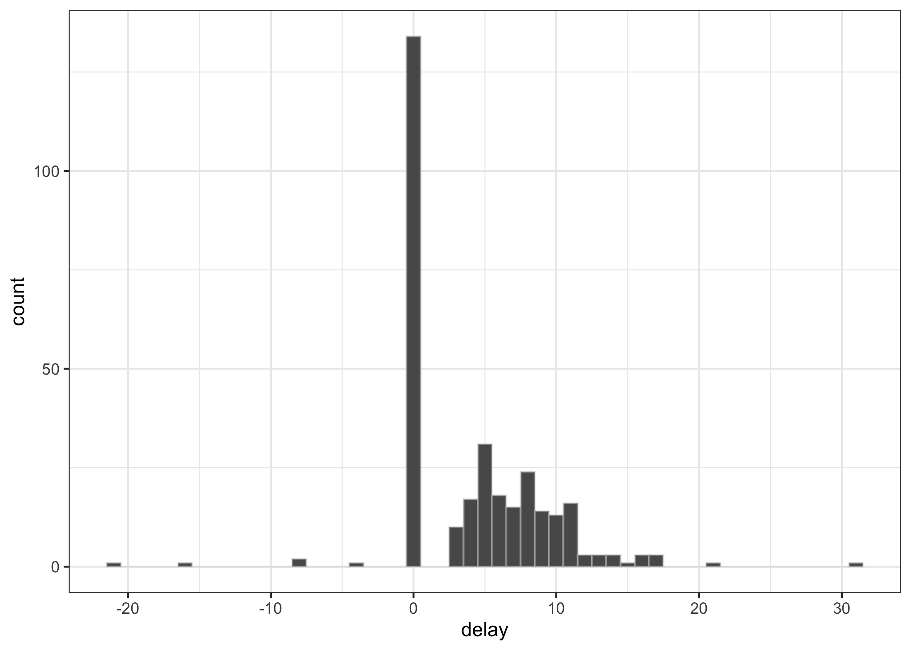
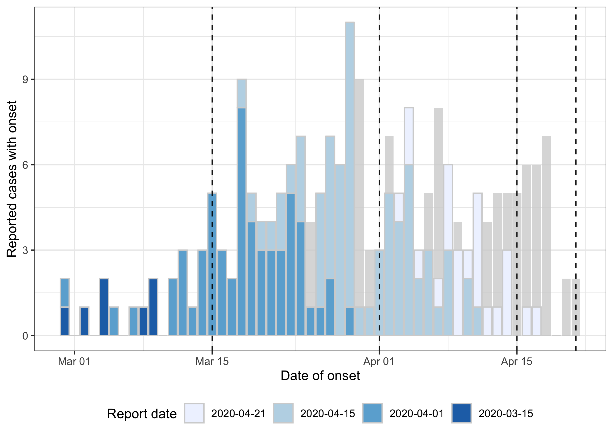
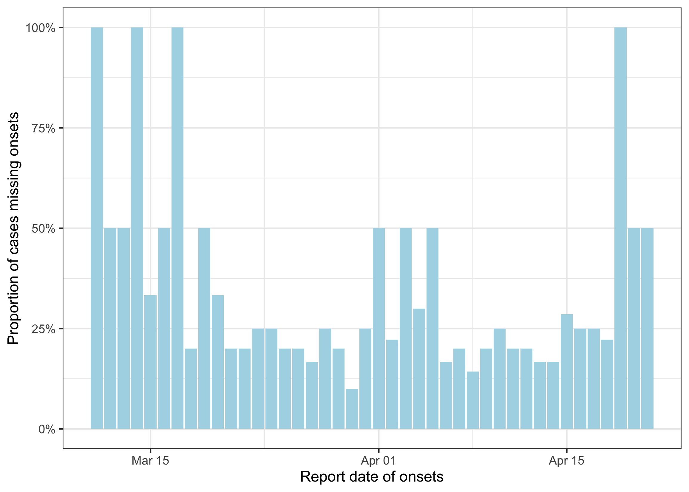
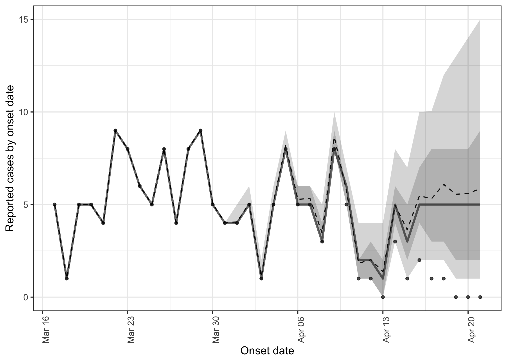
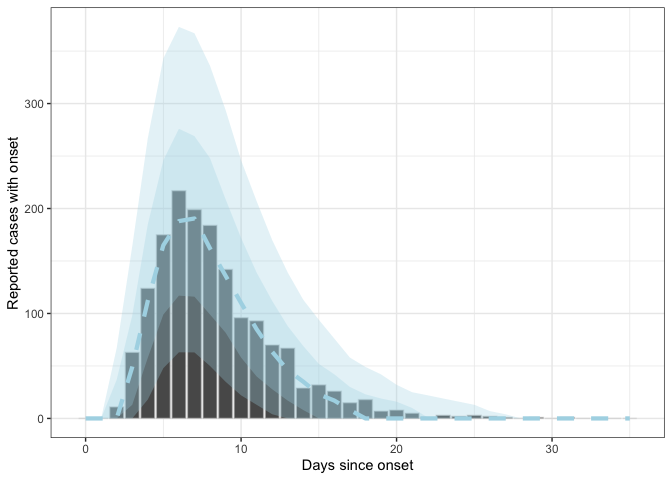
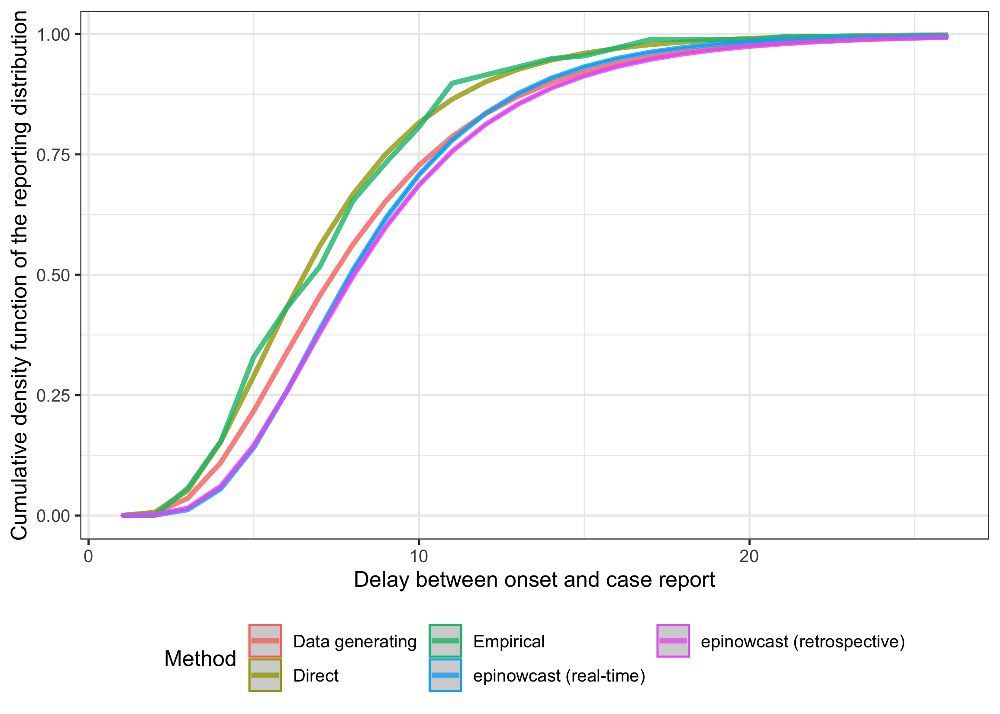

# Summary

In this report we will make use of `epinowcast` an in development
nowcasting package designed from the ground up around nowcasting and
aiming to replace `EpiNow2` for real-time usage. We first explore the
data using tools from `epinowcast` alongside others. We then nowcast the
latest available data, visualise our results, and discussion potential
options for improving performance on real-world data. As a check of our
approach we construct some retrospective data, nowcast it, and compare
our nowcast to the latest available data. We then extract the estimated
delay distribution and compare it to the underlying distribution used to
generate the data, the empirical distribution, and the distribution
estimated using simpler methods. Finally we show how the output from
`epinowcast` may be used in other surveillance packages such as
`EpiNow2`, discuss potential issues with this approach, and highlight
areas for futher work. For more on `epinowcast` see [the package
documentation](https://epiforecasts.io/epinowcast/).

# Load required libraries

    suppressPackageStartupMessages(library("epinowcast"))
    suppressPackageStartupMessages(library("EpiNow2"))
    suppressPackageStartupMessages(library("nowcasting.example")) ## devtools::install()
    suppressPackageStartupMessages(library("dplyr"))
    suppressPackageStartupMessages(library("ggplot2"))
    suppressPackageStartupMessages(library("rstan"))
    suppressPackageStartupMessages(library("posterior"))
    suppressPackageStartupMessages(library("tidyr"))
    suppressPackageStartupMessages(library("fitdistrplus"))
    suppressPackageStartupMessages(library("purrr"))

# Load the data

As in other reports in this repository this data is generated using
`inst/scripts/create_mock_dataset.r`. The simulation model is based on
real-world datasets and an underlying assumption that the reporting
delay is parametric and follows a log-normal distribution with a logmean
of 2 and a logsd of 0.5.

    df <- load_data()
    max_delay <- max(df$delay, na.rm = TRUE)
    glimpse(df)

    ## Rows: 3,278
    ## Columns: 3
    ## $ date_onset  <date> 2020-02-23, 2020-02-25, 2020-02-25, 2020…
    ## $ report_date <date> 2020-02-28, 2020-03-05, 2020-03-07, 2020…
    ## $ delay       <int> 5, 9, 11, 9, 5, 0, 0, 9, NA, 10, NA, 18, …

# Data exploration

    ggplot(df, aes(x = delay)) +
      geom_histogram(binwidth = 1) +
      theme_bw()

    ## Warning: Removed 327 rows containing non-finite values
    ## (stat_bin).

There are negative delays (report before onset) - possibly representing
either data entry errors or positive tests during the incubation period
so hard to characterise as part of the reporting delay distribution.

    df |>
      filter(delay < 0)

    ## # A tibble: 41 × 3
    ##    date_onset report_date delay
    ##    <date>     <date>      <int>
    ##  1 2020-03-08 2020-03-04     -4
    ##  2 2020-03-08 2020-02-27    -10
    ##  3 2020-03-10 2020-03-01     -9
    ##  4 2020-03-11 2020-03-05     -6
    ##  5 2020-03-11 2020-02-21    -19
    ##  6 2020-03-13 2020-03-02    -11
    ##  7 2020-03-17 2020-03-07    -10
    ##  8 2020-03-17 2020-03-13     -4
    ##  9 2020-03-18 2020-03-11     -7
    ## 10 2020-03-19 2020-03-11     -8
    ## # … with 31 more rows
    ## # ℹ Use `print(n = ...)` to see more rows

There is also a significant excess at delay 0, which does not connect
smoothly to the rest of the distribution and therefore seems to
represent a separate process.

# Preprocessing and visualising the data

Before we can estimate the reporting delay for onsets or nowcast
unreporteed onsets we need to preprocess the data into a format
`epinowcast` can make use of. We first need to restrict to delays
greater than 0 due to the evidence for two reporting processes and
aggregate data into the cumulative count format `epinowcast` expects.
Note that `epinowcast` defines the target date (here the onset date) as
the `reference_date`.

    count_df <- df |>
      filter(delay > 0 | is.na(delay)) |>
      rename(reference_date = date_onset) |>
      count(reference_date, report_date, name = "confirm") |>
      arrange(reference_date, report_date) |>
      group_by(reference_date) |>
      mutate(cum_confirm = cumsum(confirm)) |>
      ungroup() |>
      mutate(confirm = ifelse(!is.na(reference_date), cum_confirm, confirm)) |>
      dplyr::select(-cum_confirm)
    glimpse(count_df)

    ## Rows: 588
    ## Columns: 3
    ## $ reference_date <date> 2020-02-23, 2020-02-25, 2020-02-25, 2…
    ## $ report_date    <date> 2020-02-28, 2020-03-05, 2020-03-07, 2…
    ## $ confirm        <int> 1, 1, 2, 1, 2, 1, 1, 1, 2, 3, 1, 2, 3,…

We can now use preprocessing functions from `epinowcast` to complete all
combinations of report and reference dates, prepare for modelling, and
produce a range of useful summary datasets. Note that `epinowcast`
returns output as `data.table` but users can make use of whatever data
manipulation tools they are most comformfortable with. We first make
sure all date combinations are present and then use a wrapper,
`enw_preprocess_data()` to complete the rest of the required
preprocessing steps. We set the maximum delay using the largest observed
delay, though users should consider this with care as large outliers may
impact this significantly.

    complete_df <- count_df |>
      enw_complete_dates(max_delay = max_delay + 5)
    glimpse(complete_df)

    ## Rows: 1,576
    ## Columns: 3
    ## $ reference_date <date> 2020-02-23, 2020-02-23, 2020-02-23, 2…
    ## $ report_date    <date> 2020-02-23, 2020-02-24, 2020-02-25, 2…
    ## $ confirm        <int> 0, 0, 0, 0, 0, 1, 1, 1, 1, 1, 1, 1, 1,…

    enw_df <- complete_df |>
      enw_preprocess_data(max_delay = max_delay + 5)
    enw_df

    ##                     obs          new_confirm
    ## 1: <data.table[1553x7]> <data.table[1494x9]>
    ##                latest  missing_reference  reporting_triangle
    ## 1: <data.table[59x8]> <data.table[59x4]> <data.table[59x38]>
    ##         metareference          metareport          metadelay
    ## 1: <data.table[59x7]> <data.table[94x10]> <data.table[36x4]>
    ##    time snapshots by groups max_delay   max_date
    ## 1:   59        59         1        36 2020-04-21

Our output contains several useful measures including the maximum date
of data, the maximum delay, the number of days included in the dataset,
and the number of groups (here only one but this feature allows us to
nowcast over stratifications such as age or location or a combination).

To start with we may want to plot the latest available data alongside
some previous updates (blue bars increasingly pale as it gets newer) and
the data by date of report (grey bars)

    complete_df |>
      filter(
        report_date %in% as.Date(c("2020-03-15", "2020-04-01", "2020-04-15")) |
        report_date == max(report_date)
      ) |>
      mutate(report_date = factor(report_date) |>
        forcats::fct_rev()
      ) |>
      ggplot() +
      aes(
        x = reference_date, y = confirm, fill = report_date, group = report_date
      ) +
      geom_col(
        data = enw_df$new_confirm[[1]] |>
          group_by(report_date) |>
          summarise(confirm = sum(new_confirm)),
        fill = "lightgrey", alpha = 0.8,
        aes(x = report_date)
      ) +
      geom_col(position = "identity", alpha = 0.7, col = "lightgrey") +
      geom_vline(
        aes(xintercept = as.Date(report_date)), linetype = 2, alpha = 0.9
      ) +
      scale_y_continuous(labels = ~ scales::comma(.x, accuracy = 1)) +
      scale_fill_brewer(palette = "Blues") +
      theme_bw() +
      labs(
        x = "Date of onset", y = "Reported cases with onset", fill = "Report date"
      ) +
      theme(legend.position = "bottom")

    ## Warning: Removed 4 rows containing missing values (geom_col).

 In this
example the number/proportion of cases missing onsets may be of
particular interest (note modelling of this data is currently in
development for `epinowcast`).

    enw_df$missing_reference[[1]] |>
      as_tibble() |>
      filter(report_date >= "2020-03-11") |>
      ggplot() +
      aes(x = report_date, y = prop_missing) +
      geom_col(fill = "lightblue") +
      scale_y_continuous(labels = scales::percent) +
      theme_bw() +
      labs(x = "Report date of onsets", y = "Proportion of cases missing onsets")

# Nowcasting

`epinowcast` implements a generic and extended form of one of the most
common nowcasting approaches. This involves decomposing the task into
two sub-models. An expectation model that captures the evolution of the
underlying count data (here by default a daily random walk on the log
scale) and a reporting model specified using the discrete hazard of a
case being reported after a given number of days. More on the
methodology of this implementation and its links to previous literature
can be found [here](https://epiforecasts.io/epinowcast/).

We use a simple model that assumes a Poisson observation process and a
parametric log-normal reporting distribution. As a first step, we need
to compile the `epinowcast` model, we do this with `threads = TRUE` in
order to support multi-threading to speed up estimation. We also define
our fitting options (note these are passed to `cmdstanr` which is the
backend tool we use for model fitting).

    model <- enw_model(threads = TRUE)

    ## Model executable is up to date!

    fit_opts <- enw_fit_opts(
        chains = 2, parallel_chains = 2, threads_per_chain = 2,
        iter_sampling = 1000, iter_warmup = 1000,
        show_messages = FALSE, pp = TRUE
    )

We can then fit our nowcasting model. If interested in what each
component is doing the output can be inspected interactively (for
example the output of `enw_obs(family = "poisson", data = enw_df)` is
data preprocessed into the format required for modelling).

    simple_nowcast <- epinowcast(
      obs = enw_obs(family = "poisson", data = enw_df),
      data = enw_df, model = model, fit = fit_opts,
    )

    ## A grouped random walk using .group is not possible as this variable has fewer than 2 unique values.

    ## Running MCMC with 2 parallel chains, with 2 thread(s) per chain...
    ## 
    ## Chain 1 Iteration:    1 / 2000 [  0%]  (Warmup) 
    ## Chain 2 Iteration:    1 / 2000 [  0%]  (Warmup) 
    ## Chain 1 Iteration:  100 / 2000 [  5%]  (Warmup) 
    ## Chain 2 Iteration:  100 / 2000 [  5%]  (Warmup) 
    ## Chain 1 Iteration:  200 / 2000 [ 10%]  (Warmup) 
    ## Chain 2 Iteration:  200 / 2000 [ 10%]  (Warmup) 
    ## Chain 1 Iteration:  300 / 2000 [ 15%]  (Warmup) 
    ## Chain 2 Iteration:  300 / 2000 [ 15%]  (Warmup) 
    ## Chain 1 Iteration:  400 / 2000 [ 20%]  (Warmup) 
    ## Chain 2 Iteration:  400 / 2000 [ 20%]  (Warmup) 
    ## Chain 1 Iteration:  500 / 2000 [ 25%]  (Warmup) 
    ## Chain 1 Iteration:  600 / 2000 [ 30%]  (Warmup) 
    ## Chain 2 Iteration:  500 / 2000 [ 25%]  (Warmup) 
    ## Chain 1 Iteration:  700 / 2000 [ 35%]  (Warmup) 
    ## Chain 2 Iteration:  600 / 2000 [ 30%]  (Warmup) 
    ## Chain 1 Iteration:  800 / 2000 [ 40%]  (Warmup) 
    ## Chain 2 Iteration:  700 / 2000 [ 35%]  (Warmup) 
    ## Chain 1 Iteration:  900 / 2000 [ 45%]  (Warmup) 
    ## Chain 2 Iteration:  800 / 2000 [ 40%]  (Warmup) 
    ## Chain 2 Iteration:  900 / 2000 [ 45%]  (Warmup) 
    ## Chain 1 Iteration: 1000 / 2000 [ 50%]  (Warmup) 
    ## Chain 1 Iteration: 1001 / 2000 [ 50%]  (Sampling) 
    ## Chain 2 Iteration: 1000 / 2000 [ 50%]  (Warmup) 
    ## Chain 2 Iteration: 1001 / 2000 [ 50%]  (Sampling) 
    ## Chain 1 Iteration: 1100 / 2000 [ 55%]  (Sampling) 
    ## Chain 2 Iteration: 1100 / 2000 [ 55%]  (Sampling) 
    ## Chain 1 Iteration: 1200 / 2000 [ 60%]  (Sampling) 
    ## Chain 2 Iteration: 1200 / 2000 [ 60%]  (Sampling) 
    ## Chain 1 Iteration: 1300 / 2000 [ 65%]  (Sampling) 
    ## Chain 2 Iteration: 1300 / 2000 [ 65%]  (Sampling) 
    ## Chain 1 Iteration: 1400 / 2000 [ 70%]  (Sampling) 
    ## Chain 2 Iteration: 1400 / 2000 [ 70%]  (Sampling) 
    ## Chain 1 Iteration: 1500 / 2000 [ 75%]  (Sampling) 
    ## Chain 2 Iteration: 1500 / 2000 [ 75%]  (Sampling) 
    ## Chain 1 Iteration: 1600 / 2000 [ 80%]  (Sampling) 
    ## Chain 2 Iteration: 1600 / 2000 [ 80%]  (Sampling) 
    ## Chain 1 Iteration: 1700 / 2000 [ 85%]  (Sampling) 
    ## Chain 2 Iteration: 1700 / 2000 [ 85%]  (Sampling) 
    ## Chain 1 Iteration: 1800 / 2000 [ 90%]  (Sampling) 
    ## Chain 2 Iteration: 1800 / 2000 [ 90%]  (Sampling) 
    ## Chain 1 Iteration: 1900 / 2000 [ 95%]  (Sampling) 
    ## Chain 2 Iteration: 1900 / 2000 [ 95%]  (Sampling) 
    ## Chain 1 Iteration: 2000 / 2000 [100%]  (Sampling) 
    ## Chain 1 finished in 83.0 seconds.
    ## Chain 2 Iteration: 2000 / 2000 [100%]  (Sampling) 
    ## Chain 2 finished in 85.0 seconds.
    ## 
    ## Both chains finished successfully.
    ## Mean chain execution time: 84.0 seconds.
    ## Total execution time: 85.1 seconds.

The first thing we might want to do is look at the summarised nowcast
for the last week.

    simple_nowcast |>
      summary(probs = c(0.05, 0.95)) |>
      tail(n = 7)

    ##    reference_date report_date .group max_confirm confirm
    ## 1:     2020-04-15  2020-04-21      1          12      12
    ## 2:     2020-04-16  2020-04-21      1           6       6
    ## 3:     2020-04-17  2020-04-21      1           2       2
    ## 4:     2020-04-18  2020-04-21      1           1       1
    ## 5:     2020-04-19  2020-04-21      1           1       1
    ## 6:     2020-04-20  2020-04-21      1           0       0
    ## 7:     2020-04-21  2020-04-21      1           0       0
    ##    cum_prop_reported delay prop_reported    mean median
    ## 1:                 1     6    0.08333333 37.4525     37
    ## 2:                 1     5    0.50000000 32.1505     32
    ## 3:                 1     4    0.50000000 29.9510     29
    ## 4:                 1     3    1.00000000 32.3515     31
    ## 5:                 1     2    1.00000000 35.4605     33
    ## 6:               NaN     1           NaN 36.4435     32
    ## 7:               NaN     0           NaN 37.4895     33
    ##           sd     mad q5   q95      rhat ess_bulk ess_tail
    ## 1:  7.046458  7.4130 27 50.00 0.9994596 2344.852 1810.200
    ## 2:  7.988477  7.4130 20 46.05 1.0005502 2697.607 1853.062
    ## 3:  9.665211  8.8956 16 48.00 1.0004621 2056.854 1798.375
    ## 4: 12.328380 11.8608 15 55.00 1.0004179 3330.198 1888.128
    ## 5: 15.763651 13.3434 15 67.00 1.0039105 2829.697 1938.591
    ## 6: 19.564488 16.3086 12 74.00 1.0000140 3372.871 1591.971
    ## 7: 22.637096 19.2738 11 80.00 1.0012798 3617.454 1703.974

We can also plot this nowcast against the latest data.

    simple_nowcast |>
      plot() +
      labs(x = "Onset date", y = "Reported cases by onset date")

In order to inspect how our model is doing we might also want to plot
observations against posterior predictions summarised by the delay from
onset to report. Here columns are the observed data. The dashed line is
the median of summarised predictions and the ribbons are the 60% and 80%
scredible intervals. Note these are estimated by adding individual
prediction quantiles and so likely over estimate uncertainty.

    summary(simple_nowcast, type = "posterior_prediction") |>
      group_by(delay) |>
      summarise(
        across(c(new_confirm, median, q5, q20, q80, q95), ~ sum(.x)),
        .groups = "drop"
      ) |>
      ggplot() +
      aes(x = delay, y = new_confirm) +
      geom_col(col = "#d3d3d393") +
      geom_line(aes(y = median), size = 1.5, linetype = 2, col = "lightblue") +
      geom_ribbon(aes(ymin = q5, ymax = q95), alpha = 0.3, fill = "lightblue") +
      geom_ribbon(aes(ymin = q20, ymax = q80), alpha = 0.3, fill = "lightblue") +
      theme_bw() +
      labs(x = "Days since onset", y = "Reported cases with onset")

Finally, we can also look at the posterior estimates for the parametric
delay distribution (remembering that a logmean of 2 and a logsd of 0.5
was used to generate the simulated data). Here `refp_mean` denotes the
logmean and `refp_sd` denotes the log standard deviation. We see our
estimates are close to those from the data generating process though
don’t cover them at the 90% credible interval. This may be driven by
bias in the generating process, (as 0 delays are excluded), by our use
of a truncated distribution truncated by the maximum delay, inherent
loss/lack of information, or from our inference technique.

    simple_nowcast |>
      summary(type = "fit", variables = c("refp_mean", "refp_sd"))

    ##        variable      mean   median          sd         mad
    ## 1: refp_mean[1] 2.1425991 2.142870 0.011757431 0.011719953
    ## 2:   refp_sd[1] 0.4369576 0.436891 0.008375301 0.008112046
    ##           q5       q20       q80      q95     rhat ess_bulk
    ## 1: 2.1234590 2.1324700 2.1522020 2.162147 1.002183 1923.491
    ## 2: 0.4238142 0.4299816 0.4438512 0.451428 1.002422 5238.302
    ##    ess_tail
    ## 1: 1559.762
    ## 2: 1349.894

In real-world data we might expect to see delays drawn from different
distributions or no apparent distribution, time-varying delays in
reporting, overdispersed reporting, and the likelihood of reporting
varying by report date (i.e due to the day of the week etc.). All of
these complexities can be modelled using `epinowcast 0.1.0`.

As we saw in our data we also have negative delays, overinflated counts
with zero delays, reported cases missing onsets and a clear day of the
week effect in the underlying simulated data. Modelling all of these
features, rather than exluding them or ignoring them, would likely
reduce bias. These features, exluding negative delays, are on the
roadmap for `epinowcast 0.2.0` please reach out if they would be of use
to you. Negative delays are potentially the most complex modelling issue
as they are technically not possible if we define a reporting date to be
later than or equal to the reference date, which is how many nowcasting
models work. We instead need to a generative process that leads to both
of these observations. Doing this is planned for a future version of
`epinowcast` but not currently in the roadmap again reach out if this is
key to your use case.

# Retrospective evaluation

In order to understand how well our nowcasting method is working in
real-time it can be useful to have an understanding on how well it did
on past data that is know up to date, or more up to date. Here we
conduct another nowcast, in the same way as above but on a reconstructed
version of what we think the data available on the 1st of April 2020
would have looked like. The first step is to construct this
retrospective data and to extract what the latest data looks like for
this time period.

    retro_df <- complete_df |>
     enw_filter_report_dates(latest_date = "2020-04-01")

    latest_retro_obs <- complete_df |>
      enw_latest_data()
    tail(latest_retro_obs, n = 5)

    ##    reference_date report_date confirm
    ## 1:     2020-04-17  2020-04-21       2
    ## 2:     2020-04-18  2020-04-21       1
    ## 3:     2020-04-19  2020-04-21       1
    ## 4:     2020-04-20  2020-04-21       0
    ## 5:     2020-04-21  2020-04-21       0

We can now preprocess the data as before and fit the same nowcasting
model.

    retro_nowcast <- retro_df |>
      enw_preprocess_data(max_delay = max_delay) |>
      (\(x) epinowcast(
        obs = enw_obs(family = "negbin", data = x),
        data = x, model = model, fit = fit_opts,
      ))()

    ## A grouped random walk using .group is not possible as this variable has fewer than 2 unique values.

    ## Running MCMC with 2 parallel chains, with 2 thread(s) per chain...
    ## 
    ## Chain 1 Iteration:    1 / 2000 [  0%]  (Warmup) 
    ## Chain 2 Iteration:    1 / 2000 [  0%]  (Warmup) 
    ## Chain 2 Iteration:  100 / 2000 [  5%]  (Warmup) 
    ## Chain 1 Iteration:  100 / 2000 [  5%]  (Warmup) 
    ## Chain 1 Iteration:  200 / 2000 [ 10%]  (Warmup) 
    ## Chain 2 Iteration:  200 / 2000 [ 10%]  (Warmup) 
    ## Chain 1 Iteration:  300 / 2000 [ 15%]  (Warmup) 
    ## Chain 2 Iteration:  300 / 2000 [ 15%]  (Warmup) 
    ## Chain 1 Iteration:  400 / 2000 [ 20%]  (Warmup) 
    ## Chain 2 Iteration:  400 / 2000 [ 20%]  (Warmup) 
    ## Chain 1 Iteration:  500 / 2000 [ 25%]  (Warmup) 
    ## Chain 2 Iteration:  500 / 2000 [ 25%]  (Warmup) 
    ## Chain 1 Iteration:  600 / 2000 [ 30%]  (Warmup) 
    ## Chain 2 Iteration:  600 / 2000 [ 30%]  (Warmup) 
    ## Chain 1 Iteration:  700 / 2000 [ 35%]  (Warmup) 
    ## Chain 2 Iteration:  700 / 2000 [ 35%]  (Warmup) 
    ## Chain 1 Iteration:  800 / 2000 [ 40%]  (Warmup) 
    ## Chain 2 Iteration:  800 / 2000 [ 40%]  (Warmup) 
    ## Chain 1 Iteration:  900 / 2000 [ 45%]  (Warmup) 
    ## Chain 2 Iteration:  900 / 2000 [ 45%]  (Warmup) 
    ## Chain 1 Iteration: 1000 / 2000 [ 50%]  (Warmup) 
    ## Chain 1 Iteration: 1001 / 2000 [ 50%]  (Sampling) 
    ## Chain 2 Iteration: 1000 / 2000 [ 50%]  (Warmup) 
    ## Chain 2 Iteration: 1001 / 2000 [ 50%]  (Sampling) 
    ## Chain 1 Iteration: 1100 / 2000 [ 55%]  (Sampling) 
    ## Chain 2 Iteration: 1100 / 2000 [ 55%]  (Sampling) 
    ## Chain 1 Iteration: 1200 / 2000 [ 60%]  (Sampling) 
    ## Chain 2 Iteration: 1200 / 2000 [ 60%]  (Sampling) 
    ## Chain 1 Iteration: 1300 / 2000 [ 65%]  (Sampling) 
    ## Chain 2 Iteration: 1300 / 2000 [ 65%]  (Sampling) 
    ## Chain 1 Iteration: 1400 / 2000 [ 70%]  (Sampling) 
    ## Chain 2 Iteration: 1400 / 2000 [ 70%]  (Sampling) 
    ## Chain 1 Iteration: 1500 / 2000 [ 75%]  (Sampling) 
    ## Chain 2 Iteration: 1500 / 2000 [ 75%]  (Sampling) 
    ## Chain 1 Iteration: 1600 / 2000 [ 80%]  (Sampling) 
    ## Chain 2 Iteration: 1600 / 2000 [ 80%]  (Sampling) 
    ## Chain 1 Iteration: 1700 / 2000 [ 85%]  (Sampling) 
    ## Chain 2 Iteration: 1700 / 2000 [ 85%]  (Sampling) 
    ## Chain 1 Iteration: 1800 / 2000 [ 90%]  (Sampling) 
    ## Chain 2 Iteration: 1800 / 2000 [ 90%]  (Sampling) 
    ## Chain 1 Iteration: 1900 / 2000 [ 95%]  (Sampling) 
    ## Chain 2 Iteration: 1900 / 2000 [ 95%]  (Sampling) 
    ## Chain 1 Iteration: 2000 / 2000 [100%]  (Sampling) 
    ## Chain 1 finished in 51.5 seconds.
    ## Chain 2 Iteration: 2000 / 2000 [100%]  (Sampling) 
    ## Chain 2 finished in 52.2 seconds.
    ## 
    ## Both chains finished successfully.
    ## Mean chain execution time: 51.9 seconds.
    ## Total execution time: 52.3 seconds.

We now plot this retrospective nowcast against the latest available data
(noting that some of the more recently reported data may not be fully
complete yet). Here we see our approach is doing relatively well at
capturing the lastest available obserservations (triangles) using the
data available at the time (circles) though perhaps is a little more
uncertain than we might ideally like.

    plot(retro_nowcast, latest_retro_obs) +
      labs(x = "Onset date", y = "Reported cases by onset date")

# Comparison to simpler approaches

As for our `EpiNow2` comparison here we compare the etimated delay
distribution from epinowcast with empirical estimates, estimates from
simpler methods, and the known distribution used when simulating the
data.

## Empirical delay

    positive_df <- df |>
      filter(delay > 0)

    x <- 1:26
    emp <- ecdf(positive_df$delay)
    emp_cdf <- data.frame(
      delay = x,
      cdf = emp(x),
      Method = "Empirical"
    )

## Discretised lognormal fitted directly

    ddislnorm <- function(x, meanlog, sdlog) {
      return(plnorm(x, meanlog, sdlog) - plnorm(x - 1, meanlog, sdlog))
    }
    pdislnorm <- plnorm
    qdislnorm <- qlnorm

    y <- fitdist(
      positive_df$delay,
      "dislnorm",
      start = list(meanlog = 0, sdlog = 1)
    )
    ln <- pdislnorm(1:26, y$estimate[1], y$estimate[2])
    ln_cdf <- data.frame(delay = x, cdf = ln, Method = "Direct")

## Extract the lognormal CMF from `epinowcast`

    extract_epinowcast_cmf <- function(nowcast) {
      nowcast |>
      (\(x) x$fit[[1]]$draws(variables = c("refp_mean", "refp_sd")))() |>
      as_draws_df() |>
      mutate(pmf = purrr::map2(
        `refp_mean[1]`, `refp_sd[1]`,
        ~ data.frame(
          delay = 1:26, pmf = pdislnorm(1:26, .x, .y)
        ))
      ) |>
      unnest(pmf) |>
      group_by(delay) |>
      summarise(
        pmf = mean(pmf), lower_90 = quantile(pmf, 0.05),
        upper_90 = quantile(pmf, 0.95)
      )
    }

    epinowcast_cdf <- list(
      "epinowcast (real-time)" = simple_nowcast,
      "epinowcast (retrospective)" = retro_nowcast
    ) |>
      map_df(extract_epinowcast_cmf, .id = "Method")

## Comparison

    true_cdf <- data.frame(
      delay = 1:26, pmf = pdislnorm(1:26, 2, 0.5), method = "Data generating"
    )

    combined <- bind_rows(
      true_cdf,
      emp_cdf,
      ln_cdf,
      epinowcast_cdf
    )

    ggplot(combined, aes(x = delay, y = cdf, linetype = Method)) +
      geom_line() +
      geom_ribbon(
        mapping = aes(ymin = lower_90, ymax = upper_90),
        alpha = 0.25
      ) +
      theme_bw()

    ## Warning: Removed 78 row(s) containing missing values
    ## (geom_path).

    ## Warning in max(ids, na.rm = TRUE): no non-missing arguments to
    ## max; returning -Inf

    ## Warning in max(ids, na.rm = TRUE): no non-missing arguments to
    ## max; returning -Inf

    ## Warning in max(ids, na.rm = TRUE): no non-missing arguments to
    ## max; returning -Inf

# Nowcast

    ## create a data set of reported cases
    ## (would be better to use onsets but missing data are an issue)
    reported_cases <- df |>
      count(report_date, name = "confirm") |>
      rename(date = report_date)

    ## generation interval
    ## from: https://www.gov.uk/government/publications/monkeypox-outbreak-technical-briefings/investigation-into-monkeypox-outbreak-in-england-technical-briefing-1
    ## Preliminary estimate of the serial interval is 9.8 days though with high uncertainty (95% credible interval, 5.9 to 21.4).
    ## It is unclear whether this refers to the estimate of the mean, or the spread of serial intervals
    ## It is also unclear whether this is growth-adjusted
    ## interpreted as log-normally distributed with 95% contained between 5.9 and 21.4:
    ## => \mu*/\sigma*^2 = 5.9; \mu* * \sigma*^2 = 21.4
    ## => \mu* = 11,  \sigma* = 1.4
    ## (see https://en.wikipedia.org/wiki/Log-normal_distribution#Scatter_intervals)
    generation_interval <- list(
      mean = log(11),
      mean_sd = 0,
      sd = log(1.4),
      sd_sd = 0,
      max = 25
    )

    ## incubation period
    ## from: https://www.who.int/news-room/fact-sheets/detail/monkeypox
    ## "usually from 6 to 13 days but can range from 5 to 21"
    ## interpreted as log-normally distributed with 2/3 contained between 6 and 13:
    ## => \mu*/\sigma* = 6; \mu^* * \sigma* = 13
    ## => \mu* = 9, \sigma* = 1.5,  max = 21
    ## (see https://en.wikipedia.org/wiki/Log-normal_distribution#Scatter_intervals)
    ## also adding a small amount of uncertainty
    incubation_period <- list(
      mean = log(9),
      mean_sd = 0.1,
      sd = log(1.5),
      sd_sd = 0.1,
      max = 21
    )

    delays <- delay_opts(
      ## incubation period
      incubation_period,
      ## reporting delay
      est$dist
    )

    inf <- estimate_infections(
      reported_cases = reported_cases,
      generation_time = generation_interval,
      delays = delays,
      verbose = FALSE
    )

    plot(inf)
