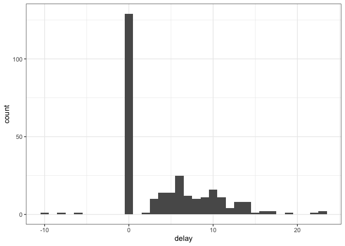
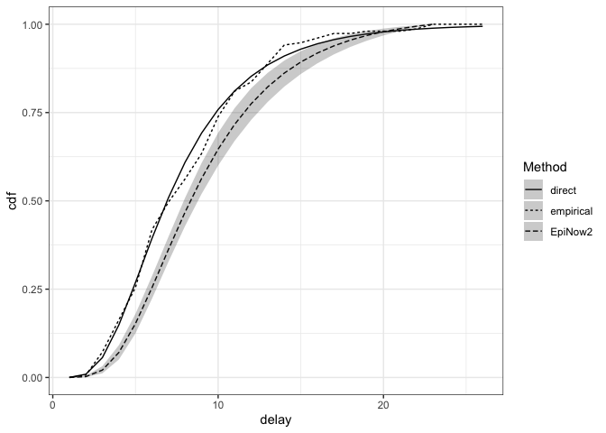
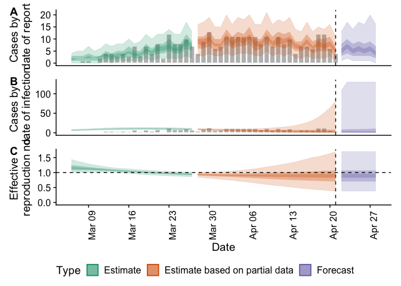

Estimating reporting delays and nowcasting/forecasting infections with
EpiNow2
================

# Load required libraries

``` r
suppressPackageStartupMessages(library("EpiNow2"))
suppressPackageStartupMessages(library("nowcasting.example")) ## devtools::install()
suppressPackageStartupMessages(library("dplyr"))
suppressPackageStartupMessages(library("ggplot2"))
suppressPackageStartupMessages(library("rstan"))
suppressPackageStartupMessages(library("posterior"))
suppressPackageStartupMessages(library("tidyr"))
suppressPackageStartupMessages(library("fitdistrplus"))
```

# Load the data

``` r
df <- load_data()
max_delay <- max(df$delay, na.rm = TRUE)
```

# Data exploration

``` r
ggplot(df, aes(x = delay)) +
  geom_histogram(binwidth = 1) +
  theme_bw()
```

    ## Warning: Removed 33 rows containing non-finite values (stat_bin).

<!-- -->

There are negative delays (report before onset) - possibly representing
either data entry errors or positive tests during the incubation period
so hard to characterise as part of the reporting delay distribution.

``` r
df |>
  filter(delay < 0)
```

    ## # A tibble: 3 × 3
    ##   date_onset report_date delay
    ##   <date>     <date>      <int>
    ## 1 2020-04-01 2020-03-26     -6
    ## 2 2020-04-02 2020-03-23    -10
    ## 3 2020-04-05 2020-03-28     -8

There is also a significant excess at delay 0, which does not connect
smoothly to the rest of the distribution and therefore seems to
represent a separate process.

# Estimating the reporting delay

We use `EpiNow2` to estimate the distribution of reporting delays
greater than 0.

``` r
positive_df <- df |>
  filter(delay > 0)
snapshots <- create_snapshots(positive_df, max_delay)
est <- suppressWarnings(estimate_truncation(
  snapshots,
  max_truncation = max_delay,
  chains = 2, iter = 2000,
  verbose = FALSE
))

## parameters of lognormal fit
est$dist
```

    ## $mean
    ## [1] 2.139
    ## 
    ## $mean_sd
    ## [1] 0.041
    ## 
    ## $sd
    ## [1] 0.507
    ## 
    ## $sd_sd
    ## [1] 0.039
    ## 
    ## $max
    ## [1] 23

# Mean delay

``` r
## Extract probability mass function

cmf <- rstan::extract(est$fit, "cmf")[[1]]
colnames(cmf) <- seq(max_delay, 1, by = -1) 
pmf <- as_draws_df(cmf) |>
  pivot_longer(c(-.chain, -.iteration, -.draw),
                      names_to = "delay") |>
  mutate(delay = as.integer(delay)) |>
  arrange(delay) |>
  group_by(.iteration, .chain, .draw) |>
  mutate(value = diff(c(0, value)))
```

    ## Warning: Dropping 'draws_df' class as required metadata was removed.

``` r
## Calculate per-sample mean
mean <- pmf |>
  group_by(.chain, .iteration, .draw) |>
  summarise(mean = sum(delay * value), .groups = "drop") |>
  summarise(
    est = mean(mean),
    lower = quantile(mean, 0.025),
    upper = quantile(mean, 0.975)
  )

## Estimate + 95% CI of mean reporting delay
mean
```

    ## # A tibble: 1 × 3
    ##     est lower upper
    ##   <dbl> <dbl> <dbl>
    ## 1  9.66  9.08  10.3

# Comparison to simpler approaches

## Empirical delay

``` r
x <- 1:26
emp <- ecdf(positive_df$delay)
emp_cdf <- data.frame(
  delay = x,
  cdf = emp(x),
  Method = "empirical"
)
```

## Discretised lognormal fitted directly

``` r
ddislnorm <- function(x, meanlog, sdlog) {
  return(plnorm(x, meanlog, sdlog) - plnorm(x - 1, meanlog, sdlog))
}
pdislnorm <- plnorm
qdislnorm <- qlnorm

y <- fitdist(
  positive_df$delay,
  "dislnorm",
  start = list(meanlog = 0, sdlog = 1)
)
ln <- pdislnorm(1:26, y$estimate[1], y$estimate[2])
ln_cdf <- data.frame(delay = x, cdf = ln, Method = "direct")

epinow_cdf <- est$cmf |>
  rename(delay = index, cdf = mean) |>
  mutate(Method = "EpiNow2")
```

## Comparison

``` r
combined <- bind_rows(
  emp_cdf,
  ln_cdf,
  epinow_cdf
)

ggplot(combined, aes(x = delay, y = cdf, linetype = Method)) +
  geom_line() +
  geom_ribbon(
    mapping = aes(ymin = lower_90, ymax = upper_90),
    alpha = 0.25
  ) +
  theme_bw()
```

    ## Warning in max(ids, na.rm = TRUE): no non-missing arguments to max; returning
    ## -Inf

    ## Warning in max(ids, na.rm = TRUE): no non-missing arguments to max; returning
    ## -Inf

<!-- -->

# Nowcast

``` r
## create a data set of reported cases
## (would be better to use onsets but missing data are an issue)
reported_cases <- df |>
  count(report_date, name = "confirm") |>
  rename(date = report_date)

## generation interval
## from: https://www.gov.uk/government/publications/monkeypox-outbreak-technical-briefings/investigation-into-monkeypox-outbreak-in-england-technical-briefing-1
## Preliminary estimate of the serial interval is 9.8 days though with high uncertainty (95% credible interval, 5.9 to 21.4).
## It is unclear whether this refers to the estimate of the mean, or the spread of serial intervals
## It is also unclear whether this is growth-adjusted
## interpreted as discretised gamma distributed with mean (5.9 + 21.4) / 2 = 13.65
## with sd = sqrt(13.65) = 3.7 (THIS IS FOR ILLUSTRATION ONLY AND SHOULD NOT BE USED)
## (see https://en.wikipedia.org/wiki/Log-normal_distribution#Scatter_intervals)
generation_interval <- list(
  mean = 13.65,
  mean_sd = 0,
  sd = 3.7,
  sd_sd = 0,
  max = 25
)

## incubation period
## from: https://www.who.int/news-room/fact-sheets/detail/monkeypox
## "usually from 6 to 13 days but can range from 5 to 21"
## interpreted as log-normally distributed with 2/3 contained between 6 and 13:
## => \mu*/\sigma* = 6; \mu^* * \sigma* = 13
## => \mu* = 9, \sigma* = 1.5,  max = 21
## (see https://en.wikipedia.org/wiki/Log-normal_distribution#Scatter_intervals)
## also adding a small amount of uncertainty
incubation_period <- list(
  mean = log(9),
  mean_sd = 0.1,
  sd = log(1.5),
  sd_sd = 0.1,
  max = 21
)

delays <- delay_opts(
  ## incubation period
  incubation_period,
  ## reporting delay
  est$dist
)

inf <- estimate_infections(
  reported_cases = reported_cases,
  generation_time = generation_interval,
  delays = delays,
  verbose = FALSE
)

plot(inf)
```

<!-- -->
